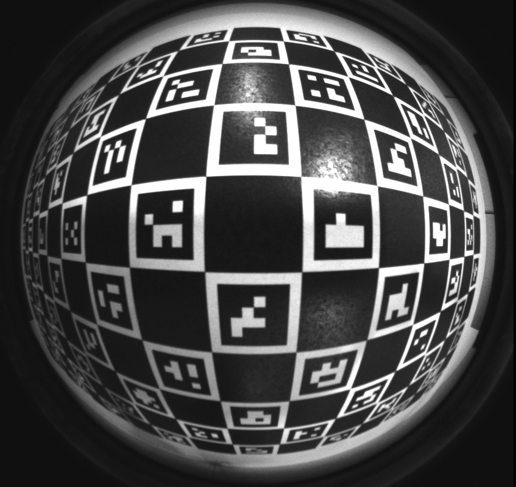
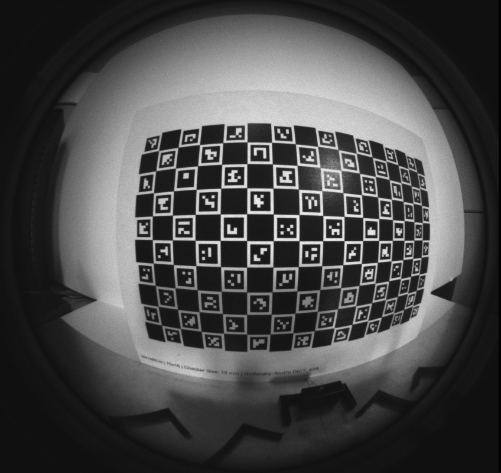
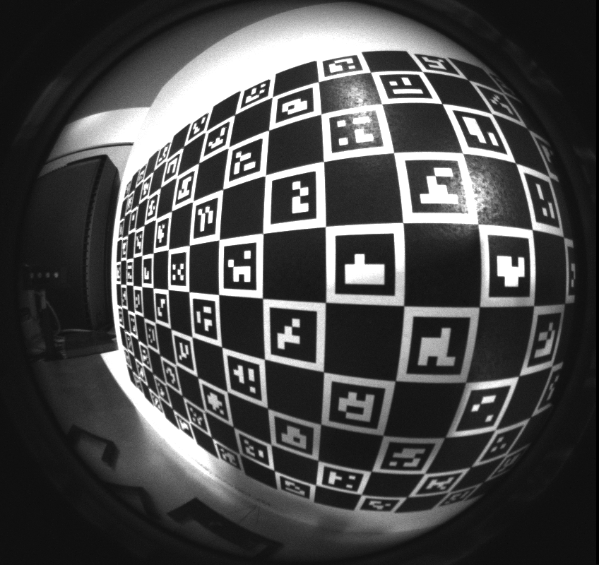

# Calibrating a T261 module after assembly into a product

In order to provide the best tracking, an accurate calibration of T261 is required. When you install the T261 module in your device you will change the extrinsics of this calibration slightly, and when you cover the module with glass you change the distortion of the images, so recalibration is required. In this example we provide a sample flow to calculate the new intrinsics and extrinsics of the stereo camera pair in T261 and write these parameters to the internal device memory on T261. The maker of the product integrating T261 should take this flow as a representative example and adapt it to whatever is most appropriate for the product and production line.

## Overview

This python sample supports the basic functionality of:
- capturing N stereo image pairs;
- performing an intrinsic calibration for both cameras;
- optionally, performing a calibration of the extrinsics between the stereo pair;
- performing a (basic) check of the quality of the calibration result (in terms of reprojection error and FOV coverage);
- writing out the calibration data into a json calibration file;
- and, optionally, writing the calibration result (intrinsics and possibly extrinsics) to the device.

The sample application also has the functionality to reset the calibration to the factory calibration.

### Command line options
The possible command line options are (a combination of):
```
--extrinsics                     // extrinsics of the stereo pair will be calibrated
                                 // and written to device in combination with --write
                                 // on default only intrinsics of the two imagers will be calibrated
--write                          // will write calibration result to the device
                                 // if calibration is succesful, user has to confirm in a prompt dialog
--confirm                        // will skip the prompt to confirm writing to device
--skip_check                     // will skip the check of some basic calibration quality criteria
--reset                          // will reset the calibration to factory calibration (and exit)
--images <PATH_TO_IMAGE_FOLDER>  // will perform calibration on a folder of recorded images
                                 // in the format that is output by the calibration tool to a temporary folder
                                 // together with a corresponding calibration file
--sn <SERIAL_NUMBER>             // will use a serial number as provided by the user
```

## Setup

### Hardware
* Calibration target: The calibration process requires a [ChAruCo target (10x16)](calib.io_charuco_297x210_10x16_15_DICT_4X4.pdf) printed on a rigid surface of approximately the size of a US letter or A4 at 100% scale. (Please check printer settings which might be different from default!)

* Lighting: Sufficient and uniform lighting and a uniform background (that can cover up to around half of the field of view) are important for good and repeatable calibration results.

* View points: Six static poses are provided, your procedure should aim to replicating them as closely as possible. It is recommended to create a mechanical fixture or use a robot to execute the poses as closely as possible and achieve repeatable calibration results. The camera images in poses.pdf can be used for a visual check of the camera poses for your device setup.


### Software
On Ubuntu 16.04 (tested), please follow the installation instructions below.

First, set up the virtual enviroment:
```
apt-get install python3-venv # install python3 built in venv support
python3 -m venv py3librs # create a virtual environment in pylibrs
source py3librs/bin/activate # activate the venv, do this from every terminal
pip install -i https://test.pypi.org/simple/ pyrealsense2==2.27.0.1062 # install librealsense python bindings, current development branch with LRS T261 calibration changes, to be updated after release (pip install pyrealsense2)
pip install opencv-python # install opencv 4.1 in the venv
pip install opencv-contrib-python # install opencv extra modules including aruco
pip install transformations # install transformations in the venv
pip install matplotlib # install matplotlib in the venv, used for debug plots
```

Then, for every new terminal:
```
source py3librs/bin/activate # Activate the virtual environment
python3 t265_aruco.py # Run the example
```

## Running the T261 calibration sample

Steps:
0. Make sure that the camera lens is clean to get the best images.
1. Capture N stereo image pairs (press key 's'). Images are accepted if minimum number of detections are found in both images.
2. After N stereo pairs are captured, calibration can be run (press key 'c').
    * Two calibration steps are performed for each camera, a first initial calibration and, after outlier removal, a second refined calibration.
    * The reprojection error (RMSE) of the refined calibration should be below 0.5 pixel for a good calibration (for the below defined set of poses and calibration target).
    * Also good coverage of the whole field of view is important and for this the below listed poses should be followed as closely as possible to obtain repeatable calibration results within our defined target accuracy. The maximum distance of detections to the camera principal point should be at least 350 pixel to allow estimation of the fisheye lens distortion towards the edges.
3. After a successful calibration the calibration data is saved to a json file (in the same folder where the calibration was run).

### Playback

The tool also supports playback from a folder of images for debugging. Use the argument `--images` to provide the input data

## Positions
### Overview
A list of camera poses can be found in [poses_left.txt](poses_left.txt) and [poses_right.txt](poses_right.txt).
The camera poses are expressed with respect to the calibration target frame (as depicted below).

 


### Position 1


 

### Position 2


 

### Position 3


 

### Position 4


 

### Position 5


 

### Position 6


 
